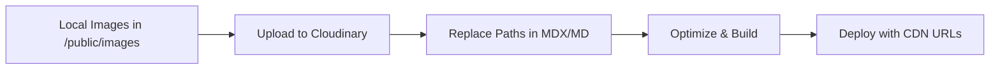

# Complete Image Pipeline Documentation

This document describes the full automated image pipeline that handles uploading, optimization, and URL replacement for blog images using Cloudinary.

## Overview

The image pipeline consists of three automated steps that run during the build process:

1. **Upload images** to Cloudinary CDN
2. **Replace local paths** with Cloudinary URLs in blog posts
3. **Optimize images** for web delivery

## Pipeline Flow



## Components

### 1. Image Upload Script (`scripts/upload-blog-images.mjs`)

**Purpose**: Uploads images from `/public/images/` to Cloudinary

**Features**:
- Smart caching using SHA-256 hash
- Only uploads new or changed images
- Stores upload history in `.cloudinary-uploads.json`
- Graceful error handling

**When it runs**: First step of `prebuild`

### 2. Path Replacement Script (`scripts/replace-image-paths.mjs`)

**Purpose**: Automatically replaces local image paths with Cloudinary URLs in blog posts

**Features**:
- Scans all `.mdx` and `.md` files in `/src/pages/posts/`
- Replaces multiple path patterns:
  - `/public/images/image.png`
  - `/images/image.png`
  - `./image.png`
- Preserves external URLs and existing Cloudinary URLs
- Reports all replacements made

**When it runs**: Second step of `prebuild`

### 3. Image Optimization (`scripts/optimize-images.mjs`)

**Purpose**: Optimizes images for development and fallback

**When it runs**: After prebuild, before Astro build

## Setup Instructions

### Prerequisites

1. **Cloudinary Account**
   - Sign up at [cloudinary.com](https://cloudinary.com)
   - Get your API credentials

2. **Environment Variables**
   
   For local development, create `.env`:
   ```bash
   CLOUDINARY_CLOUD_NAME=bdougie
   CLOUDINARY_API_KEY=your-api-key
   CLOUDINARY_API_SECRET=your-api-secret
   ```

   For Netlify, add these in Site Settings → Environment Variables

### Installation

The pipeline is already integrated into the build process. No additional setup needed!

## Usage Guide

### Adding Images to Blog Posts

#### Method 1: Direct Cloudinary URL (Manual)
```markdown

```

#### Method 2: Local Image (Automatic)
1. Add image to `/public/images/`
2. Reference in your blog post:
```markdown

```
3. On build, the pipeline will:
   - Upload `my-image.png` to Cloudinary
   - Replace the path with the Cloudinary URL

#### Method 3: Relative Path (Automatic)
```markdown

```
The pipeline will look for the image and replace with Cloudinary URL.

### Build Commands

```bash
# Development (no upload/replacement)
npm run dev

# Production build (full pipeline)
npm run build

# Manual image upload
npm run upload:images

# Manual path replacement
npm run replace:paths

# Full prebuild (upload + replace)
npm run prebuild
```

## How It Works

### Build Process

When you run `npm run build`:

1. **Prebuild** (`npm run prebuild`)
   - Runs `upload:images` → Uploads to Cloudinary
   - Runs `replace:paths` → Updates MDX/MD files

2. **Optimize** (`npm run optimize:images`)
   - Optimizes local images for fallback

3. **Build** (`astro build`)
   - Builds static site with Cloudinary URLs

### Example Transformation

**Before build:**
```markdown
<!-- In your blog post -->

```

**After build:**
```markdown
<!-- Automatically transformed -->

```

## File Structure

```
briandouglas.me/
├── public/
│   └── images/           # Local images (uploaded to Cloudinary)
├── scripts/
│   ├── upload-blog-images.mjs    # Upload script
│   ├── replace-image-paths.mjs   # Path replacement
│   └── optimize-images.mjs       # Image optimization
├── src/pages/posts/      # Blog posts (paths replaced)
├── .cloudinary-uploads.json  # Upload cache (gitignored)
└── .env                  # Local credentials (gitignored)
```

## Cloudinary URL Format

All images follow this pattern:
```
https://res.cloudinary.com/bdougie/image/upload/f_auto,q_auto/blog/[image-name]
```

- `f_auto` - Automatic format (WebP, AVIF when supported)
- `q_auto` - Automatic quality optimization
- `blog/` - Folder organization
- `[image-name]` - Original filename without extension

## Troubleshooting

### Images Not Uploading

**Check credentials:**
```bash
# Test locally
export CLOUDINARY_API_KEY=your-key
export CLOUDINARY_API_SECRET=your-secret
npm run upload:images
```

**Check logs:**
- `⚠️ Cloudinary credentials not found` - Add env vars
- `❌ Failed to upload` - Check API limits

### Paths Not Replaced

**Verify image exists:**
- Image must be in `/public/images/`
- Run `npm run replace:paths` to see detailed output

**Check path format:**
- Use `/images/` or `./` paths
- Avoid absolute URLs for local images

### Build Failures

The pipeline is designed to be non-blocking:
- Missing credentials → Skip upload, continue build
- Upload failures → Log error, continue build
- Path replacement → Only updates if image exists

### Cache Issues

Reset the upload cache:
```bash
rm .cloudinary-uploads.json
npm run upload:images
```

## Best Practices

### Image Management

1. **Naming Convention**
   - Use descriptive names: `dashboard-performance-chart.png`
   - Avoid spaces and special characters
   - Use hyphens for separation

2. **Organization**
   - Keep related images together
   - Consider date-based folders for many images
   - Clean up unused images regularly

3. **Optimization**
   - Upload high-quality originals (Cloudinary optimizes)
   - Use appropriate formats (PNG for screenshots, JPG for photos)
   - Keep file sizes reasonable (< 5MB)

### Development Workflow

1. **Local Development**
   ```bash
   # Add image to public/images/
   # Reference in blog post
   # Test locally
   npm run dev
   ```

2. **Before Commit**
   ```bash
   # Test the full pipeline
   npm run build
   # Verify paths were replaced
   git diff src/pages/posts/
   ```

3. **Production Deploy**
   - Commit changes
   - Push to GitHub
   - Netlify runs full pipeline automatically

## Security Considerations

- **Never commit credentials** - Use environment variables
- **Gitignore sensitive files**:
  - `.env` - Local credentials
  - `.cloudinary-uploads.json` - Upload cache
  - `.mcp.json` - MCP configuration

## Performance Benefits

Using this pipeline provides:

- **Global CDN delivery** - Images served from nearest location
- **Automatic optimization** - Format and quality adjusted per device
- **Lazy loading support** - Built-in browser optimization
- **Bandwidth savings** - Reduced image sizes by 30-70%
- **Improved Core Web Vitals** - Better LCP and CLS scores

## Migration Guide

### For Existing Blog Posts

1. **Identify local images:**
   ```bash
   grep -r "/images/" src/pages/posts/
   ```

2. **Add images to public/images/**

3. **Run the pipeline:**
   ```bash
   npm run prebuild
   ```

4. **Verify replacements:**
   ```bash
   git diff src/pages/posts/
   ```

5. **Commit changes**

### For New Blog Posts

Simply:
1. Add images to `/public/images/`
2. Reference as `/images/name.png`
3. The pipeline handles everything else!

## Advanced Usage

### Custom Transformations

Edit `scripts/replace-image-paths.mjs` to add custom Cloudinary transformations:

```javascript
// Add custom parameters
const cloudinaryUrl = `${CLOUDINARY_BASE_URL}/w_800,h_450,c_fill,g_auto/${imageName}`;
```

### Batch Processing

Process specific posts:
```bash
# Edit the script to target specific files
node scripts/replace-image-paths.mjs --file="2025-08-25-*.mdx"
```

### Different Folders

Upload to different Cloudinary folders:
```javascript
// In upload-blog-images.mjs
folder: 'blog/2025'  // Organize by year
```

## Support

For issues or questions:
1. Check the troubleshooting section
2. Review build logs in Netlify
3. Check Cloudinary dashboard for usage/limits
4. Open an issue on GitHub

## Changelog

- **v1.0** - Initial pipeline with upload and replacement
- **v1.1** - Added smart caching and hash comparison
- **v1.2** - Integrated path replacement into build process

---

*Last updated: August 2025*